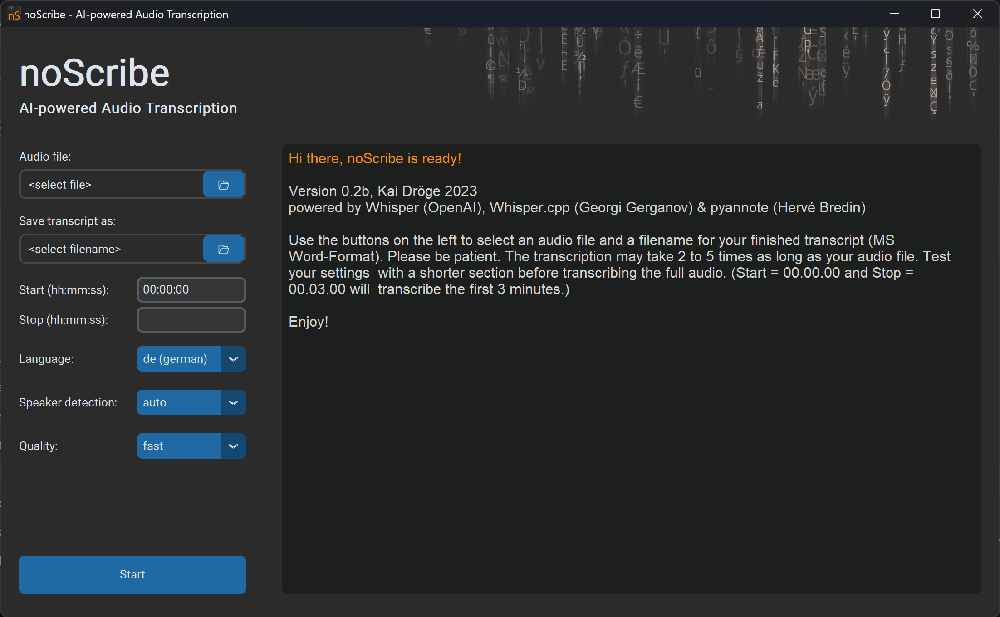
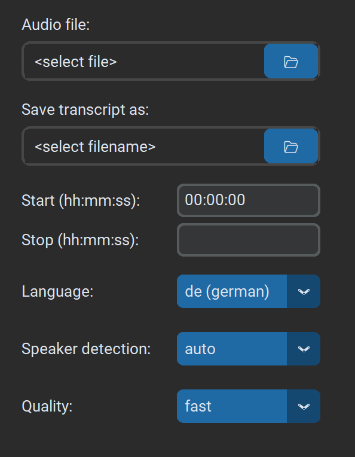
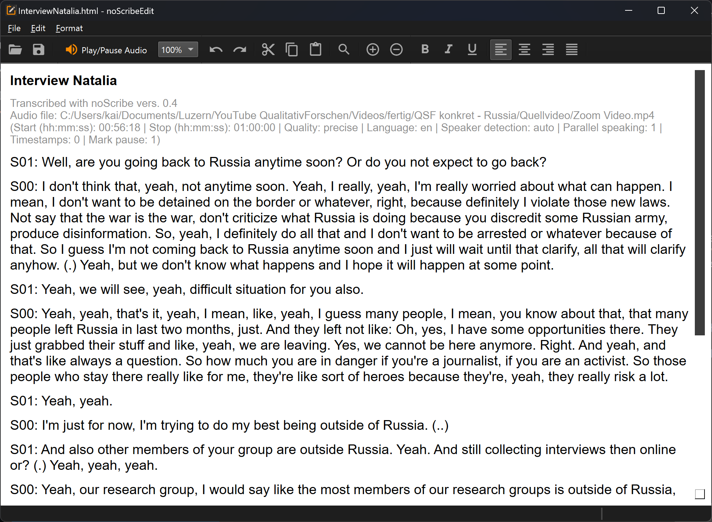

# noScribe
> ## Cutting Edge AI Technology for Automated Audio Transcription

## What is noScribe?
- An AI-based software that **transcribes interviews** for qualitative social research or journalistic use
- noScribe is **free and open source** ([GPL-3.0](https://www.gnu.org/licenses/gpl-3.0.html))
- It runs **completely local** on your computer. No data is sent to the internet. No cloud, no worries
- It can distinguish different **speakers** and understands 99 languages (more or less, see below)
- It includes a **nice editor** to review, verify and correct the resulting transcript
- It is standing on the shoulders of giants: [Whisper from OpenAI](https://github.com/openai/whisper), [faster-whisper by Guillaume Klein](https://github.com/guillaumekln/faster-whisper) and [pyannote from Hervé Bredin](https://github.com/pyannote/pyannote-audio)

   

(The transcript is from [this interview](https://www.youtube.com/watch?v=vOwajAbvPzQ&t=2018s) which I did in May 2022 with the Russian sociologist Natalia Savelyeva.)

## Limitations 
- noScribe needs a fairly up-to-date computer, or the transcription will take forever. (Consider letting it run over night on a slower machine.)
- Since it uses sophisticated AI models, the download is quite large – about 3.7 GB
- Poor audio quality will lead to poor transcription results. 
- No automatic transcription is perfect, there will always be some manual revision necessary. Use the [included Editor](#noscribeedit) to check your transcripts thouroughly. (See also ["Factors Influencing the Quality"](#factors-influencing-the-quality-of-the-transcription) and ["Known Issues"](#known-issues) below.)
- If you want to know more an can understand German, Rebecca Schmidt from the University of Paderborn wrote a nice [review of noScribe,](https://sozmethode.hypotheses.org/2315) also discussing its limitations.

## Why the Name "noScribe"?
The [urban dictionary](https://www.urbandictionary.com/define.php?term=Scribe) defines **scribe** as *"a person whose entire miserable existence has been reduced to academic grunge and pain".* I hope this software will make your academic life a little less painful and grungy, hence the name noScribe :)

## About Me
**Kai Dröge**, PhD in sociology (with a background in computer science), qualitative researcher and teacher, [Lucerne University for Applied Science (Switzerland)](https://www.hslu.ch/de-ch/hochschule-luzern/ueber-uns/personensuche/profile/?pid=823) and [Institute for Social Research, Frankfurt/M. (Germany)](https://www.ifs.uni-frankfurt.de/personendetails/kai-droege.html).

## Download and Installation
**Current Version Number: 0.5** (see [changelog](CHANGELOG.md))
> All releases are hosted on SWITCHdrive, a secure data sharing platform for Swiss universities.

### Windows
- The **general purpose version** for normal PCs without a NVIDIA graphics card: [https://drive.switch.ch/index.php/s/EIVup04qkSHb54j?path=%2FnoScribe%20vers.%200.5%2FWindows%2Fnon%20cuda](https://drive.switch.ch/index.php/s/EIVup04qkSHb54j?path=%2FnoScribe%20vers.%200.5%2FWindows%2Fnon%20cuda) 
- A special version using **CUDA acceleration on NVIDIA graphics cards** with at least 6 GB of VRAM: [https://drive.switch.ch/index.php/s/EIVup04qkSHb54j?path=%2FnoScribe%20vers.%200.5%2FWindows%2Fcuda](https://drive.switch.ch/index.php/s/EIVup04qkSHb54j?path=%2FnoScribe%20vers.%200.5%2FWindows%2Fcuda). You must also install the [CUDA toolkit from here](https://developer.nvidia.com/cuda-downloads?target_os=Windows) (a reboot is required afterwards).
- **Installation**: 
    - Start the downloaded setup file. This may take a while, be patient.
    - If you get a warning that "Windows protected your PC" and the app comes from an "Unknown publisher", you have to trust us and click "Run anyway"
    - To do a silent install on a larger group of computers, start the setup with the argument `/S`.  

### MacOS 
ported by [gernophil](https://github.com/gernophil)  
- **Newer Macs with Apple Silicon M1-M4 processors**
    - Download: [https://drive.switch.ch/index.php/s/EIVup04qkSHb54j?path=%2FnoScribe%20vers.%200.5%2FmacOS%2Farm64%20(Apple%20Silicon)](https://drive.switch.ch/index.php/s/EIVup04qkSHb54j?path=%2FnoScribe%20vers.%200.5%2FmacOS%2Farm64%20(Apple%20Silicon))
    - Double-click on the downloaded dmg-file, then drag noScribe and noScribeEdit into the link to your applications folder (labeled "drag both here to install").
    - Start noScribe and/or noScribeEdit by double-clicking the app within your applications 
- **Older Macs with Intel processors**
    - for macOS Sonoma (14): [https://drive.switch.ch/index.php/s/EIVup04qkSHb54j?path=%2FnoScribe%20vers.%200.5%2FmacOS%2Fx86_64%20(Intel)](https://drive.switch.ch/index.php/s/EIVup04qkSHb54j?path=%2FnoScribe%20vers.%200.5%2FmacOS%2Fx86_64%20(Intel))
    - for macOS 11 (Big Sur), 12 (Monterey) and 13 (Ventura): [https://drive.switch.ch/index.php/s/EIVup04qkSHb54j?path=%2FnoScribe%20vers.%200.5%2FmacOS%2Fx86_64_legacy%20(old%20Intel)](https://drive.switch.ch/index.php/s/EIVup04qkSHb54j?path=%2FnoScribe%20vers.%200.5%2FmacOS%2Fx86_64_legacy%20(old%20Intel))
    - Note: Unfortunately, we are currently not able to sign the x86_64 package correctly, so you will get a warning that noScribe and noScribeEdit are from unregistered developers. You have to manually allow noScribe and noScribeEdit to be executed, if your Gatekeeper is active. Follow these steps:
    - Double-click the downloaded dmg-file.
    - Drag noScribe and noScribeEdit into the link to your applications folder (labeled "drag both here to install")
    - Start noScribe by double-clicking the app within your applications folder. You will get an error that noScribe is from an unregistered developer. Do the same with the noScribe Editor.
    - Go to Settings -> Privacy and Security -> Scroll down until you see a message stating noScribe was prevented from starting and click "open anyway". Again, do the same with the noScribe Editor.
    - From now on, both programs should start without issues.

### Linux
ported by [Eckhard Kadasch](https://github.com/eckhrd) and [Florian Dobener](https://github.com/domna)
(Installation instructions will follow)

### Old versions:
- [https://drive.switch.ch/index.php/s/EIVup04qkSHb54j](https://drive.switch.ch/index.php/s/EIVup04qkSHb54j) 

## Citation (APA Style)
Dröge, K. (2024). noScribe. AI-powered Audio Transcription (Version XXX) [Computer software]. https://github.com/kaixxx/noScribe

## Usage
### Settings

- Select your **audio file** and a **filename for the transcript.**
- **Start** and **Stop** accept timestamps in the format hh:mm:ss. Use this to limit the transcription to a particular part of the recording. This is especially helpful for testing your settings with a small sample before committing to transcribing the whole interview, which may take several hours. Leave **Stop** empty if you want to transcribe until the end of the audio file.
- **Language:** Select the language of your transcript or set it to 'auto'.
- **Quality:** 'Precise' is the recommended setting for the most accurate transcript. On slower machines, you may opt for the 'fast' option. This will be quicker but might necessitate more manual revision later.
- **Mark Pause**: If enabled, parts of your audio without voice activity will be marked as pauses. Pauses are transcribed as round brackets with one dot per second inside, e.g., '(..)' for a two-second pause. Pauses longer than 10 seconds are written out as '(XX seconds pause)' or '(XX minutes pause)'. You have the option to mark either pauses of one second and more ('1sec+'), two seconds and more ('2sec+'), or only the longer ones of three seconds and more ('3sec+'). Choose 'none' to disable this feature entirely.
**Speaker Detection:** Choosing 'auto' utilizes the Pyannote AI model to identify distinct speakers in your audio, organizing the transcript accordingly. Opting for 'none' bypasses this step, shaving off approximately half the process time. However, the resultant transcript will be a continuous block of text without any indicators of speaker transitions.
- **Overlapping Speech**: If enabled, noScribe attempts to mark instances where two people speak simultaneously. The overlapping section is demarcated with //double slashes//. (Note: This is an experimental feature.)
- **Timestamps**: When enabled, noScribe incorporates timestamps in the format [hh:mm:ss] into the transcript either at every change of speaker or every 60 seconds. I find these timestamps somewhat distracting, hence my decision to disable them by default. However, they can be quite useful in certain contexts. Even with timestamps disabled, determining the audio timecode for a specific segment is straightforward: simply open the transcript in the noScribe Editor, navigate through the text, and the corresponding timecode will appear in the bottom right corner of the app.

### Transcription process
- If you are ready, click the **Start**-button in the bottom left. **Cancel** will abort the process. 
- Be aware that **a one-hour interview can take two to five hours processing time** and will put a heavy load on your machine. Doing this on battery-power is not recommended.
- A **progress bar** at the bottom of the app will show how far you are into the whole process. 
- The **main window** will log progress-messages and errors. It will also show the text of your interview during the last step of the transcription. 
- The transcript will be auto saved every few seconds under the given filename.
- NoScribe produces an HTML-file. This can be opened in every common word editor (including MS Word, LibreOffice). 
- Before working with the transcript though, you should check it with the included editor. There will always be some errors. Click on the filename in the progress window (blue + underlined) to edit the file. 

## noScribeEdit 
The included editor to check the final transcript. 

The noScribe Editor is a separate app that can also be run independent from noScribe. It contains some handy features to check your finished transcript for errors and correct them:
- Press **Ctrl + Spacebar** or the **orange button in the toolbar** to hear the audio which corresponds to your current position in the text. 
- The **selection of the text will follow the audio that you hear**. If you want to **make changes,** click anywhere in the text with your mouse or use the arrow keys to move the cursor. The audio will stop, and you can edit the text.
- You can also **stop the audio** by pressing Ctrl + Spacebar again or clicking the orange button.
- If you want to **speed up or slow down the audio**, change the "100%"-field next to the "Play/Pause Audio"-Button to the appropriate speed.
- Use the loupe in the toolbar to **zoom in or out**
- You will find the **most common features of a basic text editor** in the toolbar as well as in the menu at the top (basic text formatting, cut, copy & paste, undo & redo).
- Your typical **hotkeys** will also work (e.g., Ctrl+S for Save). You can see all the hotkeys if you open the menu. As already mentioned, 'Ctrl+Space' is the hotkey you'll use the most as it starts or pauses the audio.

The source code of the editor can be found here: [https://github.com/kaixxx/noScribeEditor](https://github.com/kaixxx/noScribeEditor)

## Factors Influencing the Quality of the Transcription
- A **good audio recording with clear voices and no ambient noise** is crucial for a high-quality transcription. Investing some effort in the quality of the recording will save you much time in the manual revision process later. 
- Whisper (the AI powering noScribe) understands 99 different languages, but the quality of the transcription varies widely between them. **Spanish, Italian, English, Portuguese and German** are best supported (see [here for more info]( https://github.com/openai/whisper#available-models-and-languages)).
- Whisper handles **dialects** fairly well (e.g., Swiss-German), but the transcript might need more manual work in the revision.

## Known Issues
- The whisper AI can sometimes get **stuck in a loop of repeating text,** especially on longer audio files. If this happens, try to transcribe shorter sections (using the "Start" and "Stop" fields in noScribe), and join them manually.
- **Multilingual audio** is not supported. If the language changes mid interview, whisper will actually try to translate the text, which is usually not what we want.
- **Filler words** like "uhm" and especially **nonverbal expressions** like laughter are often not included in the transcript, although they are usually required for a good qualitative analysis. You must add these elements manually. (The identification of filler words works best if you select the correct language for the transcript, not "auto".) 
- **Speaker identification:** In some recordings, the AI used by noScribe may not be able to tell the voices of certain speakers apart, even if they sound quite different to the human ear. It may also happen that noScribe identifies more speakers in a recording then there actually are. Check the results carefully.
- The whisper AI can sometimes **hallucinate**, especially in silent parts of the recording when it interprets background noise as 'text'. Check your transcripts carefully. 

## Advanced Options
- After the app has run for the first time, you will find a file named **config.yml** in the user config directory (on windows: C:\Users\<username>\AppData\Local\noScribe\noScribe\config.yml). Here, you can change a few **extra settings,** e.g., the language of the user interface.
- **Prompts**: The whisper AI can be initialized with a short text-sequence called prompt (see [here for more info](https://platform.openai.com/docs/guides/speech-to-text/prompting)). This will influence the style of the following transcription. I tried to force the AI to include filler words like "uhm" in the transcription by giving it a prompt containing them (like "Umm, let me think like, hmm."). But this only worked on some occasions (whisper tends to 'forget' the prompt quite quickly). Prompts are language specific and will only be applied if you select a particular language (not 'auto'). You can change or add prompts for other languages in the file "prompt.yml" in the home directory of the app. Please don’t use prompts longer than one sentence since this will mess up the speaker separation.
- Also in the user config directory you will find a folder named **log** with detailed log-files for every transcript (also unfinished ones). This can be helpful in the case of any errors. Be aware though that these files also contain the text of your transcripts which might include sensitive information. 

## Development and Contribution
- I developed noScribe in python 3.9
- If you want to run noScribe directly from the source, I recommend setting up pyannote and all its dependencies first. You **must use my fork of pyannote,** which includes a small modification run on local files only.
- I cannot host the whisper-models on GitHub because they are too large. There is a readme in the models-folder with instructions on how to get them. 
- I am happy to review tests, bug reports and pull requests (if my time allows it)

### Translations
- The noScribe UI has already been translated into many languages (thanks mlynar-czyk).
- Since most of the translations have been created with ChatGPT, there will be problems. Please report any errors that you’ll find and make – if possible – a pull request with a better translation. 
- You will find the language files in the folder "trans". 
- If you change anything in the language files, make sure to follow the conventions of the YAML language.
- If you want to change the language of the user interface, you have to change the value of the "locale" setting in the advanced settings (see above).

## Other Software
If you are interested in open source software for the analysis of qualitative data, take a look at [QualCoder](https://github.com/ccbogel/QualCoder) and [Taguette](https://www.taguette.org/).
