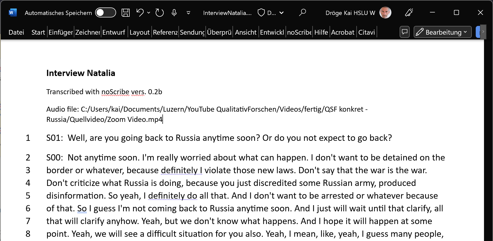

# noScribe 
## Cutting Edge AI Technology for Automated Audio Transcription

**Download** current release (0.3):\
[Windows](https://drive.switch.ch/index.php/s/EIVup04qkSHb54j?path=%2FnoScribe%20vers.%200.3%2FWindows)\
[macOS](https://drive.switch.ch/index.php/s/EIVup04qkSHb54j?path=%2FnoScribe%20vers.%200.3%2FmacOS) (alpha version, Apple silicon M1/M2 only, ported by [gernophil](https://github.com/gernophil))

## What is noScribe?
- noScribe is **free and open source** ([GPL-3.0](https://www.gnu.org/licenses/gpl-3.0.html))
- It runs locally on your computer. **No cloud, no worries**
- Its main purpose is to **transcribe interviews** for qualitative research or journalistic use
- It can distinguish different **speakers** and understands 99 languages (more or less, see below)
- It includes a **nice MS Word-interface** to review, verify and correct the resulting transcript
- It is standing on the shoulders of giants: [Whisper from OpenAI](https://github.com/openai/whisper), [Whisper.cpp by Georgi Gerganov](https://github.com/ggerganov/whisper.cpp) and [pyannote from Hervé Bredin](https://github.com/pyannote/pyannote-audio)

(The transcript is from [this interview](https://www.youtube.com/watch?v=vOwajAbvPzQ&t=2018s) I did in May 2022 with the Russian sociologist Natalia Savelyeva.)

## Limitations 
- noScribe needs a fairly up-to-date computer, or the transcription will take forever. (Consider letting it run over night on a slower machine.)
- Since it uses sophisticated AI models, the download is quite large – about 3.7 GB
- Poor audio quality will lead to poor transcription results. 
- No automatic transcription is perfect, there will always be some manual revision necessary. Use the included Word-interface to check your transcripts thouroughly. (See also ["Factors Influencing the Quality"](#factors-influencing-the-quality-of-the-transcription) and ["Known Issues"](#known-issues) below.)

## Why the Name "noScribe"?
The [urban dictionary](https://www.urbandictionary.com/define.php?term=Scribe) defines **scribe** as *"a person whose entire miserable existence has been reduced to academic grunge and pain".* I hope this software will make your academic life a little less painful and grungy, hence the name noScribe :)

## About Me
**Kai Dröge**, PhD in sociology (with a background in computer science), qualitative researcher and teacher, [Lucerne University for Applied Science (Switzerland)](https://www.hslu.ch/de-ch/hochschule-luzern/ueber-uns/personensuche/profile/?pid=823) and [Institute for Social Research, Frankfurt/M. (Germany)](https://www.ifs.uni-frankfurt.de/personendetails/kai-droege.html).

## Usage
### Installation
- **Download** the latest release for your operating system from here: [noScript releases](https://drive.switch.ch/index.php/s/EIVup04qkSHb54j) (SWITCHdrive is a secure data sharing platform for Swiss universities)
- Start the downloaded setup file. This may take a while, be patient.

### Settings

- Select your **audio file** and a **filename for the transcript.**
- **Start** and **Stop** accept timestamps in the format hh:mm:ss. Use this to limit the transcription to a particular part of the recording. This is especially helpful to test your settings with a small sample before committing to transcribe the whole interview, which may take several hours. Leave Stop empty if you want to transcribe till the end of the audio file.
- **Language:** choose the language of your transcript or leave it on "auto"
- **Speaker detection:** "auto" will use the pyannote AI model to detect different speakers in your audio and structure the transcript accordingly. Setting this to "none" will skip this step and save you about half the time of the whole process. But the resulting transcript will be a continuous text without any information about speaker changes. 
- **Quality:** "precise" is the recommended setting and will give you the most accurate transcript. On a slower machine, you can also try the "fast" option. This will be much quicker but requires more manual revision afterwards. 
- If you are ready, click the **Start**-button in the bottom left. **Cancel** will abort the process. 
- Be aware that **a one-hour interview can take two to five hours processing time** and will put a heavy load on your machine. Doing this on battery-power is not recommended.
- A **progress bar** at the bottom of the app will show how far you are into the whole process. 
- The **main window** will log progress-messages and errors. It will also show you the text of your interview during the last step of the transcription. 
- The transcript will be auto saved every few seconds under the given filename.

### Revising the Transcript in MS Word 

The document produced by noScribe will contain some helpful macros to work with your transcript.
- Open the document in MS Word and allow for the **active content** (the macros) in the yellow security warning at the top.
- Press **Ctrl + Spacebar** to hear the audio corresponding to your current position in the text. 
- The **selection of the text will follow the audio that you hear**. If you want to **make changes,** click anywhere in the text with your mouse or use the arrow keys to move the cursor. The audio will stop, and you can edit your text.
- You can also stop the audio by pressing **Ctrl + Spacebar** again.
- **Reliability:** Whisper marks every segment of the transcript with a so called 'confidence level' (CL), reaching from 0-10. A low CL means that the transcription is less reliable and might contain errors. You can highlight these unreliable segments in your document in red. Press **Alt + r** (for reliability) and enter a CL value in the dialog box (3 is a good starting point). Every segment with this or a lower CL is now marked. Enter a CL of 0 to make all markings disappear (the default setting).

## Factors Influencing the Quality of the Transcription
- A **good audio recording with clear voices and no ambient noise** is crucial for a high-quality transcription. Investing some effort in the quality of the recording will save you much time in the manual revision process later. 
- Whisper (the AI powering noScribe) understands 99 different languages, but the quality of the transcription varies widely between them. **Spanish, Italian, English, Portuguese and German** are best supported (see [here for more info]( https://github.com/openai/whisper#available-models-and-languages)).
- Whisper handles **dialects** fairly well (i.e., Swiss-German), but the transcript might need more manual work in the revision.
- **Multilingual audio** is not supported. If the language changes mid interview, whisper will actually try to translate the text, which is usually not what we want.
- **Quick back and forth between different speakers** is not always handled well. Some statements might get attributed to the wrong speaker, which must be corrected in the revision phase. The same is true for **speaker overlap/parallel speaking.**
- **Speech dysfluencies** like "uhm", short interruptions or **nonverbal expressions** like laughter are usually not included in the transcript, although they might be required for a good qualitative analysis. You must add these elements manually using the functions in Word described above. (You can also play with the "prompt"-option described under "advanced options" below, but I had limited success.)
- The whisper AI can sometimes **hallucinate**, especially in silent parts of the recording when it interprets background noise as 'text'. Check your transcripts carefully. 

## Known Issues
- The whisper AI can sometimes get **stuck in a loop of repeating text,** especially on longer audio files. If this happens, try to transcribe shorter sections (using the "Start" and "Stop" fields in noScribe), and join them manually.

## Advanced Options
- **Prompts**: The whisper AI can be initialized with a short text-sequence called prompt (see [here for more info](https://platform.openai.com/docs/guides/speech-to-text/prompting)). This will influence the style of the following transcription. I tried to force the AI to include filler words like "uhm" in the transcription by giving it a prompt containing them (like "Umm, let me think like, hmm..."). But this only worked on some occasions (whisper tends to 'forget' the prompt quite quickly). Prompts are language specific and will only be applied if you select a particular language (not 'auto'). You can change or add prompts for other languages in the file "prompt.yml" in the home directory of the app.
- After the app has been closed for the first time, you will find a file named **config.yml** in the user config directory (on windows: C:\Users\<username>\AppData\Local\noScribe\noScribe\config.yml). Here, you can change a few **extra settings,** i.e., the language of the user interface.
- "whisper_extra_commands" can be defined in config.yml and will be attached to the end of the command line for whisper.cpp. Use this to experiment with advanced options. See https://github.com/ggerganov/whisper.cpp/tree/master/examples/main for a list of options. Be careful: If your options change the output of main.exe in the terminal, noScribe might not be able to interpret this and fail badly...
- Also in the user config directory you will find a folder named **log** with detailed log-files for every transcript (also unfinished ones). This can be helpful in the case of any errors. Be aware though that these files also contain the text of your transcripts which might include sensitive information. 

## Development and Contribution
- I developed noScribe in python 3.9
- If you want to run noScribe directly from the source, I recommend setting up pyannote and all its dependencies first. You **must use my fork of pyannote,** which includes a small modification run on local files only.
- Also use my fork of python-docx. Again, I had to make a very small change so python-docx accepts also documents with macros (.docm).    
- Downloading whisper/whisper.cpp is not necessary since I use the compiled version of whisper.cpp ("main.exe").
- I am happy to review tests, bug reports and pull requests (if my time allows it)

### Translations
- It would be great to see noScribe being translated into more languages. 
- You will find the language files in the folder "trans". Copy "noScribe.en.yml" (the English version, usually most complete) and translate it. 
- Make sure you follow the conventions of the YAML language.
- Your new language should be picked up automatically once you restart noScribe. You can also change your default language in the advanced settings (see above).

### MAC and LINUX support
- noScribe has been ported to macOS by [gernophil](https://github.com/gernophil): (https://drive.switch.ch/index.php/s/EIVup04qkSHb54j?path=%2FnoScribe%20vers.%200.3%2FmacOS) (alpha version, Apple silicon M1/M2 only) 
- A version for LINUX is in preparation.
- If you make any changes to the code of noScribe.py, try not to break compatibility with other platforms. I would like to keep one single codebase for all platforms.

## Other Software
If you are interested in open source software for the analysis of qualitative data, take a look at [QualCoder](https://github.com/ccbogel/QualCoder) and [Taguette](https://www.taguette.org/).
