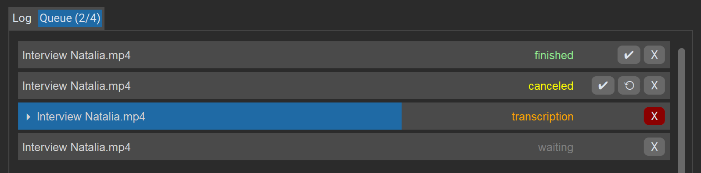

# noScribe
### Cutting Edge AI Technology for Automated Audio Transcription
</br>

> [!WARNING]
> Somebody has registered the domain **noscribe(dot)ai** to sell transcription services. **Stay away from this platform, I have nothing to do with it.** The real noScribe is free and always will be. This is obviously an attempt to profit from the popularity of my software and the reputation it gained over the years. Very sad. 

## What is noScribe?
- An app to produce **high quality transcripts of interviews** for qualitative social research or journalistic use
- noScribe is **free and open source** ([GPL-3.0](https://www.gnu.org/licenses/gpl-3.0.html)), available for Windows, MacOS and Linux 
- It runs **completely locally** on your computer, protecting the confidentiality of your interviews. No cloud, no worries
- It can distinguish between different **speakers** and understands around 60 languages (more or less, see below)
- It includes a **nice editor** to review, verify and correct the resulting transcript
- It is standing on the shoulders of giants: [Whisper from OpenAI](https://github.com/openai/whisper), [faster-whisper by Guillaume Klein](https://github.com/guillaumekln/faster-whisper) and [pyannote from Hervé Bredin](https://github.com/pyannote/pyannote-audio)

</br>


(The transcript is from [this interview](https://www.youtube.com/watch?v=vOwajAbvPzQ&t=2018s) which I did in May 2022 with the Russian sociologist Natalia Savelyeva.)

## Limitations
- The download is quite large (several gigabytes) due to the included AI models. 
- Beware that a one hour interview can take up to three hours to transcribe, depending on your machine. 
- Poor audio and background noise will lead to poor transcription results.
- No automatic transcription is perfect, there will always be some manual revision necessary. Use the [included Editor](#noscribeedit) to check your transcripts thoroughly. (See also ["Factors Influencing the Quality"](#factors-influencing-the-quality-of-the-transcription) and ["Known Issues"](#known-issues) below.)

If you want to know more and can understand German, Rebecca Schmidt from the University of Paderborn wrote a nice [review of noScribe,](https://sozmethode.hypotheses.org/2315) also discussing its limitations. Also the German [computer magazine c't recommended noScribe in a recent review](https://www.heise.de/select/ct/2025/2/2433207582191637980).

## Why the Name "noScribe"?
The [urban dictionary](https://www.urbandictionary.com/define.php?term=Scribe) defines **scribe** as *"a person whose entire miserable existence has been reduced to academic grunge and pain".* I hope this software will make your academic life a little less painful and grungy, hence the name noScribe :)

## About Me
**Kai Dröge**, PhD in sociology (with a background in computer science), qualitative researcher and teacher, [Lucerne University for Applied Science (Switzerland)](https://www.hslu.ch/de-ch/hochschule-luzern/ueber-uns/personensuche/profile/?pid=823) and [Institute for Social Research, Frankfurt/M. (Germany)](https://www.ifs.uni-frankfurt.de/personendetails/kai-droege.html).

## Donate
NoScribe is free and always will be. However, developing it costs real money. I have purchased hardware for testing and pay Apple annually for a developer ID. If you would like to support this project, you can make a donation on Ko-Fi. Thanks! 

[](https://ko-fi.com/noscribe)

## Download and Installation

**Current Version Number: 0.7** (see [changelog](CHANGELOG.md))
> All releases are hosted on SWITCHdrive, a secure data sharing platform for Swiss universities.

### Windows
<details>
    <summary>Click to expand</summary>

- **Download:**
    - The **general purpose version** for normal PCs without an NVIDIA graphics card: [https://drive.switch.ch/index.php/s/EIVup04qkSHb54j?path=%2FnoScribe%20vers.%200.7%2FWindows%2Fnormal](https://drive.switch.ch/index.php/s/EIVup04qkSHb54j?path=%2FnoScribe%20vers.%200.7%2FWindows%2Fnormal) 
    - A special version using **CUDA acceleration on NVIDIA graphics cards** with at least 6 GB of VRAM: [https://drive.switch.ch/index.php/s/EIVup04qkSHb54j?path=%2FnoScribe%20vers.%200.7%2FWindows%2Fcuda](https://drive.switch.ch/index.php/s/EIVup04qkSHb54j?path=%2FnoScribe%20vers.%200.7%2FWindows%2Fcuda). Make sure that your NVIDIA drivers are on version 570.65 or higher. You must also install the [CUDA toolkit from here](https://developer.nvidia.com/cuda-downloads?target_os=Windows) (a reboot is required afterwards).
- **Installation**: 
    - Start the downloaded setup file. This may take a while, be patient.
    - If you get a warning that "Windows protected your PC" and the app comes from an "Unknown publisher", you have to trust us and click "Run anyway"
    - To do a silent install on a larger group of computers, start the setup with the argument `/S`.

</details>

### MacOS
<details>
    <summary>Click to expand</summary>

ported by [gernophil](https://github.com/gernophil) </br>

- **Newer Macs with Apple Silicon M1-M4 processors and macOS 14 or newer**
    - Download: [https://drive.switch.ch/index.php/s/EIVup04qkSHb54j?path=%2FnoScribe%20vers.%200.7%2FmacOS%2FApple%20Silicon](https://drive.switch.ch/index.php/s/EIVup04qkSHb54j?path=%2FnoScribe%20vers.%200.7%2FmacOS%2FApple%20Silicon)
    - Double-click on the downloaded dmg-file, then drag noScribe and noScribeEdit into the link to your applications folder (labeled "drag both here to install").
    - You will need Apple's Rosetta2 Intel emulator since one component (ffmpeg) is still made for Intel CPUs. If you don't have it installed already, do this as follows:
        - Open the Terminal (located at `/Applications/Utilities/Terminal.app`).
        - Type `softwareupdate --install-rosetta` or `softwareupdate --install-rosetta --agree-to-license`.
        - Hit enter and follow the instructions on the screen.
    - Start noScribe and/or noScribeEdit by double-clicking the app within your applications.

- **Older Macs with Intel processors**
    - **Note: Version 0.7 is currently not available for Intel based Macs** due to incompatibilities with the newest pyannote release. You can, however, use version 0.6: [https://drive.switch.ch/index.php/apps/files/?dir=/noScribe/noScribe%20releases/noScribe%20vers.%200.6/macOS/x86_64%20(Intel)&fileid=8266174681](https://drive.switch.ch/index.php/apps/files/?dir=/noScribe/noScribe%20releases/noScribe%20vers.%200.6/macOS/x86_64%20(Intel)&fileid=8266174681).
    - Older versions may be available here: [https://drive.switch.ch/index.php/s/EIVup04qkSHb54j](https://drive.switch.ch/index.php/s/EIVup04qkSHb54j)
    - Unfortunately, we are not able to sign the x86_64 package correctly, so you will get a warning that noScribe and noScribeEdit are from unregistered developers. You have to manually allow noScribe and noScribeEdit to be executed, if your Gatekeeper is active. Follow these steps:
    - Double-click the downloaded dmg-file.
    - Drag noScribe and noScribeEdit into the link to your applications folder (labeled "drag both here to install").
    - Start noScribe by double-clicking the app within your applications folder. You will get an error that noScribe is from an unregistered developer. Do the same with the noScribe Editor.
    - Go to Settings -> Privacy and Security -> Scroll down until you see a message stating noScribe was prevented from starting and click "open anyway". Again, do the same with the noScribe Editor.
    - From now on, both programs should start without issues.

</details>

### Linux
<details>
    <summary>Click to expand</summary>

ported by [Eckhard Kadasch](https://github.com/eckhrd) and [Florian Dobener](https://github.com/domna); executable generated by [gernophil](https://github.com/gernophil).

#### Executable Installation

  - Download the CUDA or CPU version of noScribe 0.7 for Linux here: [https://drive.switch.ch/index.php/s/EIVup04qkSHb54j?path=%2FnoScribe%20vers.%200.7%2FLinux](https://drive.switch.ch/index.php/s/EIVup04qkSHb54j?path=%2FnoScribe%20vers.%200.7%2FLinux)
  - Untar the file using the terminal command `tar -xzvf noScribe_0.7.0_cpu_linux_amd64.tar.gz` or `tar -xzvf noScribe_0.7.0_cuda_linux_amd64.tar.gz`.
  - Execute noScribe using the terminal by `cd`ing into the noScribe folder and executing `./noScribe`.
  - Optionally: Edit the files `noScribe.desktop` and `noScribeEdit.desktop` with a text editor and enter the complete path in the lines starting with `Exec=` and `Icon=`.

#### Manual Installation From Source

See [this discussion](https://github.com/kaixxx/noScribe/discussions/83) for
more information.

If you want to install from source, `git` and `git-lfs` are necessary to get
all required pieces. The latest sources are directly fetched from the
repository. Please use the installation above (executable installation) if
you want to install a specific version.

```bash
git clone https://github.com/kaixxx/noScribe.git

# After that, everything happens in the `noScribe` directory.
cd noScribe

# Install noScribeEdit
rm -rf noScribeEdit/
git clone https://github.com/kaixxx/noScribeEditor.git noScribeEdit

# Create a python virtual environment.
python3 -m venv venv

# After the following command, python from the virtual environment is used. Also
# package installations land here. Remember to run this command every time, you
# want to start noScribe.
source venv/bin/activate

# Install necessary dependencies.
pip install -r environments/requirements_linux.txt
pip install -r noScribeEdit/environments/requirements.txt

# Download model files. Here, the precise as well as the fast models are
# downloaded. If you use only one of them, it is enough to download only the
# respective models.
rm -rf models/fast
rm -rf models/precise
git clone https://huggingface.co/mukowaty/faster-whisper-int8 models/fast
git clone https://huggingface.co/mobiuslabsgmbh/faster-whisper-large-v3-turbo models/precise

# Run noScribe.
python3 ./noScribe.py
```

</details>

### Old versions:
- [https://drive.switch.ch/index.php/s/EIVup04qkSHb54j](https://drive.switch.ch/index.php/s/EIVup04qkSHb54j)

## Citation (APA Style)
Dröge, K. (2025). noScribe. AI-powered Audio Transcription (Version XXX) [Computer software]. https://github.com/kaixxx/noScribe

## Usage
### Settings


- Select your **audio file**. NoScribe supports almost any audio or video format. You can also select several files at once for [batch transcription](#batch-transcription).
- Select the **filename for the transcript.** You can also choose the file type: *.html is the default, supported also by the noScribe editor. *.vtt is a video subtitles format and is especially useful if you want to import your transcript into [EXMARaLDA](https://exmaralda.org/) for further annotation. *.txt exports the transcript as plain text.
- **Start** and **Stop** accept timestamps in the format hh:mm:ss. Use this to limit the transcription to a particular part of the recording. This is especially helpful for testing your settings with a small sample before committing to transcribing the whole interview, which may take several hours. Leave **Stop** empty if you want to transcribe until the end of the audio file.
- **Language:** Select the language of your transcript. Set it to "auto" to detect the language, or choose "multilingual" if your audio contains more than one language (experimental).
- **Quality:** "Precise" is the recommended setting for the most accurate transcript. On slower machines, you may opt for the "fast" option. This will be quicker but might necessitate more manual revision later. You can also [install custom models](https://github.com/kaixxx/noScribe/wiki/Add-custom-Whisper-models-for-transcription), fine-tuned for specific languages, etc.
- **Mark Pause**: If enabled, parts of your audio without voice activity will be marked as pauses. Pauses are transcribed as round brackets with one dot per second inside, e.g., "(..)" for a two-second pause. Pauses longer than 10 seconds are written out as "(XX seconds pause)" or "(XX minutes pause)". You have the option to mark either pauses of one second and more ("1sec+"), two seconds and more ("2sec+"), or only the longer ones of three seconds and more ("3sec+"). Choose "none" to disable this feature entirely.
- **Speaker Detection:** This feature uses the Pyannote AI model to identify distinct speakers in your audio and organizes the transcript accordingly. Choose the number of speakers if known, or select "auto." Opting for "none" bypasses this step altogether, reducing the processing time by approximately half. However, the resultant transcript will be a continuous block of text without any indicators of speaker transitions.
- **Overlapping Speech**: If enabled, noScribe attempts to mark instances where two people speak simultaneously. The overlapping section is demarcated with //double slashes//. (Note: This is an experimental feature.)
- **Disfluencies**: If enabled, common speech disfluencies like filler words ("um"), unfinished words or sentences, etc. will also be transcribed. Note that this is not a hard on/off switch, but more of a 'recommendation' for the transcription AI model which only works to some extent.   
- **Timestamps**: When enabled, noScribe incorporates timestamps in the format [hh:mm:ss] into the transcript either at every change of speaker or every 60 seconds. I find these timestamps somewhat distracting, hence my decision to disable them by default. However, they can be quite useful in certain contexts. Even with timestamps disabled, determining the audio timecode for a specific segment is straightforward: simply open the transcript in the noScribe Editor, navigate through the text, and the corresponding timecode will appear in the bottom right corner of the app.

### Transcription process
- If you are ready, click the **Start**-button in the bottom left. **Cancel** will abort the process.
- Be aware that **a one-hour interview can take up to three hours processing time** and will put a heavy load on your machine. Doing this on battery-power is not recommended.
- A **progress indicator** at the bottom of the app will show how far you are into the whole process.
- The **main window** (log tab) will show progress-messages and errors. It will also print the text of your interview during the last step of the transcription.
- The transcript will be auto saved every few seconds under the given filename.
- By default, noScribe produces an HTML-file. This can be opened in every common word editor (including MS Word, LibreOffice) or QDA-package (MAXQDA, ATLAS.ti, QualCoder...).
- Before working with the transcript though, you should check it with the included editor. There will always be some errors.

### Batch transcription 
(new in version 0.7)



- The "Queue" tab in the main window shows a list of all jobs as well as their state and progress.
- If you start a new job while another is still running, the new job will wait in the queue to be processed afterwards.
- To start multiple jobs at once with the same settings, select as many files as you want in the audio file dialog. The output files will be named automatically. Use the "Save transcript as" dialog to select a different output folder if needed. Otherwise, the transcripts will be stored in the same folders as the audio. 
- The job buttons:
    - `X` Deletes a job from the list or cancels a running one.
    - `✔` Opens the transcript in the included editor. This also works for unfinished transcripts in case of an error or if the job was canceled by the user.
    - `⟲` Restarts the job (only available in case of errors or cancelation).       

## noScribeEdit
The included editor to check the final transcript.


The noScribe Editor is a separate app. It will open automatically once the transcript is finished, but can also be run independently from noScribe. It contains some handy features to check your finished transcript for errors and correct them:
- Press **Ctrl + Spacebar** (^Space on Mac) or the **orange button in the toolbar** to hear the audio which corresponds to your current position in the text.
- The **selection of the text will follow the audio that you hear**. If you want to **make changes,** click anywhere in the text with your mouse or use the arrow keys to move the cursor. The audio will stop, and you can edit the text.
- You can also **stop the audio** by pressing Ctrl + Spacebar again or clicking the orange button.
- If you want to **speed up or slow down the audio**, change the "100%"-field next to the "Play/Pause Audio"-Button to the appropriate speed.
- To change the **speaker names,** use the Search & Replace feature, accessible from the magnifying glass icon or the Edit menu.
- Use the plus and minus icons in the toolbar to **zoom in or out**
- You will find the **most common features of a basic text editor** in the toolbar as well as in the menu at the top (basic text formatting, cut, copy & paste, undo & redo).
- Your typical **hotkeys** will also work (e.g., Ctrl+S for Save, Ctrl+F for Find & Replace). You can see all the hotkeys if you open the menu. As already mentioned, 'Ctrl+Space' is the hotkey you'll use the most as it starts or pauses the audio.


The source code of the editor can be found here: [https://github.com/kaixxx/noScribeEditor](https://github.com/kaixxx/noScribeEditor)

## Factors Influencing the Quality of the Transcription
- A **good audio recording with clear voices and no ambient noise** is crucial for a high-quality transcription. Investing some effort in the quality of the recording will save you much time in the manual revision process later.
- Whisper (the AI powering noScribe) understands around 60 different languages, but the quality of the transcription varies widely between them. **Spanish, Italian, English, Portuguese and German** are best supported (see [here for more info]( https://github.com/openai/whisper#available-models-and-languages)).
- Whisper handles **dialects** fairly well (e.g., Swiss-German), but the transcript might need more manual work in the revision.

## Known Issues

- The output of this software always needs to be checked for quality, misunderstandings, and wrong speaker diarization. This software is based on [OpenAI's Whisper model](https://github.com/openai/whisper). Typical word error rates can be seen [here](https://github.com/openai/whisper?tab=readme-ov-file#available-models-and-languages). See also [this paper](https://doi.org/10.1145/3576915.3624380) for a comparison of different transcription services and their errors.

- Like any other large language model, the whisper model can sometimes **hallucinate**. This is especially prevalent in silent audio passages or when background noise is treated as "text" (see [this study from the Cornell University](https://facctconference.org/static/papers24/facct24-111.pdf) for more info about the issue). We use voice activity detection (VAD) to filter out sections without speech as best as possible. 

  More severely, users also reported cases where words were hallucinated that would fit syntactically into the context, but were actually not present in the original audio. Such errors are especially hard to catch. 

- The whisper AI can sometimes get **stuck in a loop of repeating text,** especially on longer audio files. If this happens, try to transcribe shorter sections (using the "Start" and "Stop" fields in noScribe), and join them manually.

- **Multilingual audio** is now supported, but experimental. Sometimes it can happen that words in other languages than the main language are translated.

- **Nonverbal expressions** like laughter are not included in the transcript and must be added later in the editor if you need them.

- **Speaker diarization:** In some recordings, the AI used by noScribe may not be able to tell the voices of certain speakers apart, even if they sound quite different to the human ear. Check the results carefully.

- It can happen that **punctuation and capitalization** are lost over time, especially in longer interviews. If you run into this issue, you can
  - Try to transcribe shorter sections (using the "Start" and "Stop" fields in noScribe), and join them manually.
  - Try to use another model, especially "faster-whisper-large-v2", which is less prone to this problem. You have to install this model first as described [in the Wiki](https://github.com/kaixxx/noScribe/wiki/Add-custom-Whisper-models-for-transcription).


## Advanced Options

- After the app has run for the first time, you will find a file named `config.yml` in the user config directory (on Windows: `C:\Users\<username>\AppData\Local\noScribe\noScribe\config.yml`; on Mac OS: `~/Library/Application Support/noscribe/config.yml`; on Linux: `~/.config/noScribe/config.yml`). Here, you can change a few **extra settings**, e.g., the language of the user interface and model parameters.
- Also in the user config directory you will find a folder named `log` with detailed log-files for every transcript (also unfinished ones). This can be helpful in the case of any errors. Be aware though that these files also contain the text of your transcripts which might include sensitive information.
- If you want to use **custom whisper models** with noScribe, follow the [instructions in the Wiki](https://github.com/kaixxx/noScribe/wiki/Add-custom-Whisper-models-for-transcription).

## Development and Contribution
- I developed noScribe in python 3.12
- I cannot host the whisper-models on GitHub because they are too large. There is a readme in the models-folder with instructions on how to get them.
- I am happy to review tests, bug reports and pull requests (if my time allows it)

### Translations
- The noScribe UI has already been translated into many languages (thanks mlynar-czyk).
- Since most of the translations have been created with ChatGPT, there will be problems. Please report any errors that you’ll find and make – if possible – a pull request with a better translation.
- You will find the language files in the folder "trans".
- If you change anything in the language files, make sure to follow the conventions of the YAML language.
- If you want to change the language of the user interface, you have to change the value of the "locale" setting in the advanced settings (see above).

## Other Software
If you are interested in open source software for the analysis of qualitative data, take a look at my other project [QualCoder](https://github.com/ccbogel/QualCoder).


